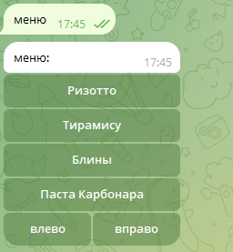
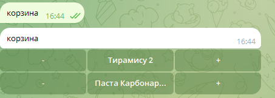

# Чат-бот для заказа еды
Заказать вкусную еду легко и быстро-просто напишите этому чат-боту! Он поможет Вам выбрать блюда из меню и оформит заказ.
## Что умеет чат-бот
-  Можно выбрать одну из кнопок: "меню", "корзина", "оформить заказ".
- После нажатия на кнопку "меню"  Вам покажут меню со всеми блюдами.
- После нажатия на кнопку "корзина" монжно увидеть все добавленные Вами блюда.
- После нажатия на кнопку "оформить заказ" Вам выведут чек.
## Чему научилась 
- Создание структуры JSON-файла для хранения записей.
- Новый тип кнопок ReplyKeyboardMarkup для отправки шаблонных сообщений.
- Универсальная функция для работы с корзиной: добавление и
изменение блюд.
- Кнопки для изменения количества блюда в корзине.
- Оформление чека.
- Возможность указать телефон и адрес доставки.
## Работа чат-бота
### Меню

### Корзина

### Оформление заказа

